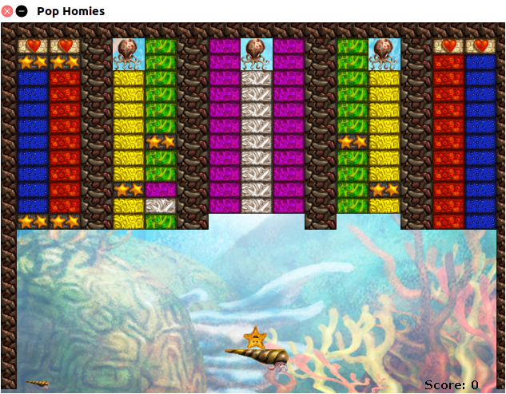

# Rainbow Reef
Rainbow reef is a single player game. The player controls a shellfish named Katch using the left and right arrow keys. The main objective of the game is to bounce Pop (the star) off of your shell and into the BigLegs (squid-like characters). Pop must eliminate all of the blocks guarding the BigLegs first before it can attack them. If Pop falls off the screen, the player loses a life. If all lives are lost, you lose the game. To win the game, you must eliminate all of the Biglegs. 

## Controls
The left and right arrow keys are the only controls that you need to play the game.

## Installing 
All you need to have installed to run this program is [Java](https://www.java.com/en/download/help/download_options.xml).

## Running The Program 
Option 1:

You can run the game just by running the RainbowReef.jar file located in the src folder
    
    - Clone the repository 
    - Navigate into the src folder 
    - java -jar RainbowReef.jar

Option 2: 

Create your own jar file

  - Clone the repository 
  - cd into src
  - find -name "*.java" > sources.txt
  - javac @sources.txt
  - echo "Main-Class: application.Main" >> MANIFEST.MF
  - jar cfvm RainbowReefGame.jar MANIFEST.MF .
  - java -jar RainbowReefGame.jar

On success, this window should pop up, and you're ready to play! 

## Design Patterns
- Model View Controller
- Observer/Observable

## Built With 
- [Java.awt](https://docs.oracle.com/javase/7/docs/api/java/awt/package-summary.html) : We utilized this in order to use the MVC pattern (key events, key listeners, etc.)
- [Javax.swing](https://docs.oracle.com/javase/7/docs/api/javax/swing/package-summary.html) : We used this to work with Jframes and Jpanels and to aid with painting graphics onto the panel.
- [Javax.imageio](https://docs.oracle.com/javase/7/docs/api/javax/imageio/package-summary.html) : This was used to get our sprites into the game.

## Authors
- Gerren Penaloza
- Satjit Bola

